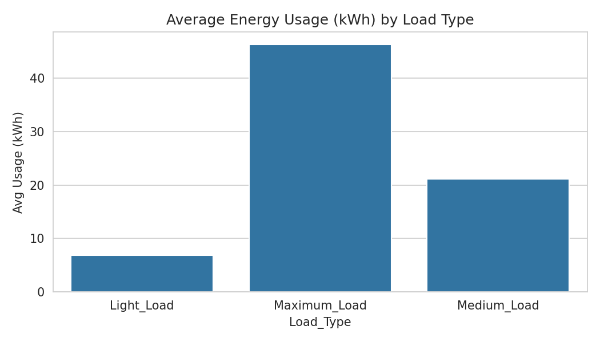
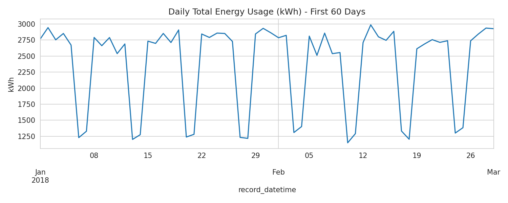
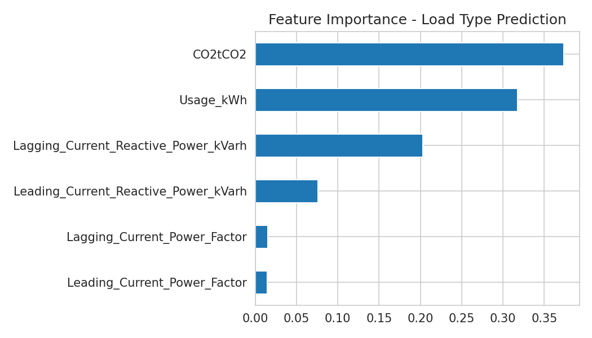
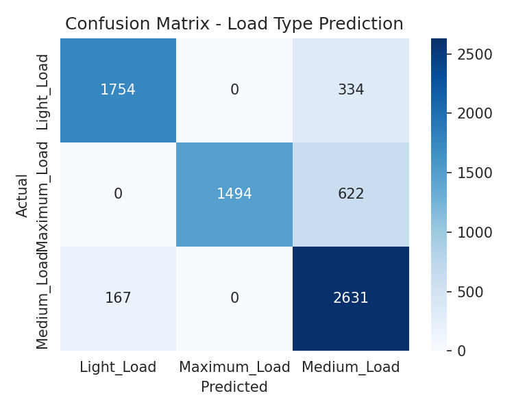

# Steel Plant Energy Analytics — ETL, KPI Dashboard & Load Prediction

End-to-end data analytics pipeline on industrial energy consumption data:
SQL-based storage → Python ETL/cleaning → KPI aggregation → BI-ready exports
→ machine learning model predicting plant load type from live electrical readings.

> **Note on data:** This repo ships with a synthetic sample generator
> (`src/generate_sample_data.py`) so the pipeline runs end-to-end out of the
> box. For the real project, download the actual **Steel Industry Energy
> Consumption** dataset (DAEWOO Steel Co., South Korea — 35,040 records,
> 15-minute intervals, 2018) from Kaggle or the UCI ML Repository, save it as
> `data/raw/Steel_industry_data.csv`, and skip the generator step. The schema
> is identical either way, so every downstream script works unchanged.

## Pipeline

```
generate_sample_data.py  →  clean_data.py  →  eda_and_model.py  →  Power BI / Tableau
   (or real Kaggle CSV)      (SQL schema)      (KPIs, charts, ML)
```

1. **`src/clean_data.py`** — parses timestamps, removes sensor-glitch
   readings, median-imputes missing values, caps outliers at the 99th
   percentile, engineers `hour_of_day` and `shift` features.
2. **`sql/schema.sql`** — MySQL schema + KPI queries (usage by load type,
   weekday vs weekend, shift-wise power factor, top usage spikes).
3. **`src/eda_and_model.py`** — generates KPI CSVs for direct import into
   Power BI/Tableau, exploratory charts, and a Random Forest classifier that
   predicts `Load_Type` (Light/Medium/Maximum) from live electrical readings.

## Results

- Cleaned **35,010 of 35,040** records (99.9% retained) — see
  `data/processed/data_quality_report.txt`
- **Random Forest classifier: 84% accuracy** predicting plant load type from
  usage, reactive power, and power factor readings alone
  (`models/model_metrics.txt`, `models/model_summary.json`)
- KPI tables ready for BI import: `data/processed/kpi_*.csv`

| Usage by Load Type | Daily Usage Trend |
|---|---|
|  |  |

| Feature Importance | Confusion Matrix |
|---|---|
|  |  |


# Option A: use the built-in synthetic generator (works immediately)
python src/generate_sample_data.py

# Option B: use the real dataset — download from Kaggle/UCI and save as
# data/raw/Steel_industry_data.csv, then skip straight to the next step

python src/clean_data.py
python src/eda_and_model.py
```

Then load `data/processed/cleaned_steel_energy.csv` into MySQL via
`sql/schema.sql`, and connect Power BI/Tableau to either the MySQL table or
the `data/processed/kpi_*.csv` files directly.

## Tech Stack

Python (Pandas, NumPy, scikit-learn, Matplotlib, Seaborn) · MySQL · Power BI / Tableau

## Project Structure

```
steel-energy-project/
├── data/
│   ├── raw/                  # source CSV
│   └── processed/            # cleaned data + KPI exports
├── sql/schema.sql            # DB schema + KPI queries
├── src/
│   ├── generate_sample_data.py
│   ├── clean_data.py
│   └── eda_and_model.py
├── models/                   # metrics + summary
├── visuals/                  # charts
└── requirements.txt
```

## Resume Bullet

> Built end-to-end ETL pipeline processing 35,000+ manufacturing energy
> records using Python and SQL, engineered KPI dashboards tracking load type,
> shift efficiency, and CO2 output, and trained a Random Forest classifier
> achieving 84% accuracy predicting plant load state from real-time
> electrical readings.
